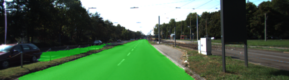
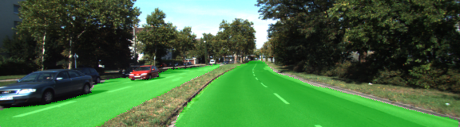
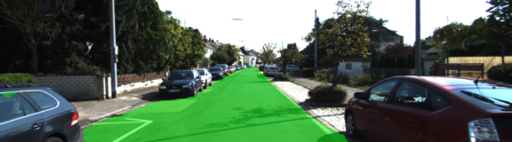

# Car-ND Semantic Segmentation
This is my achievement for the Term 3 project 2 for Car-ND.

## Run
Run the following command to run the project:
```
python main.py
```

## Implementation
Instead of following a simple FCN structure introduced in the class, I tried some techniques inspired from the literature.

### Network Structure
The main idea of my network structure is to **concatenate feature maps with different size:** Such a structure is inspired from the [Pyramid Scene Parsing Network (PSPNet)](https://arxiv.org/abs/1612.01105). Unlike PSPNet, I directly concatenated feature maps with different size instead of a pyramid pooling module. While the intuition is that the segmentation result combines both high-level semantics and low-level features. **What's more**, I also concatenate convolved feature maps at the half level of input image resolution. With only one or two layers of convolution, the feature maps should represent smoothed outline between objects. This is inspired from [this paper](http://cn.arxiv.org/abs/1411.6228). I used convolution layers instead of their *smoothing prior*  Luckily, after several epochs of training, the result show good edges of the road.

See [main.py](main.py) for detailed implementation. I made some changes to the `layers()` and `project_tests.test_layers()` functions, since I added `vgg_input_tensor` as an input param.

### Training Strategy
- The initial `learning rate` was set to be `1e-4`, and decrease with steps when training certain epochs. Total number of training epochs was 30.
- `AdamOptimizer` was adopted.
- `batch_size` was set to be only 1. This leads to fastest convergence to a semantic segmentation task.

## Performance
Luckily, I found my performance was very good, with fine outline of the road and no large misclassified regions. Here are some examples below:



